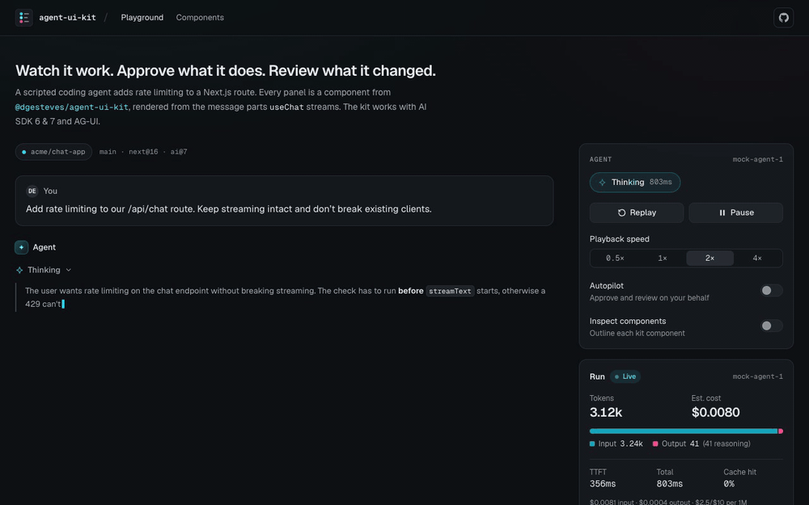
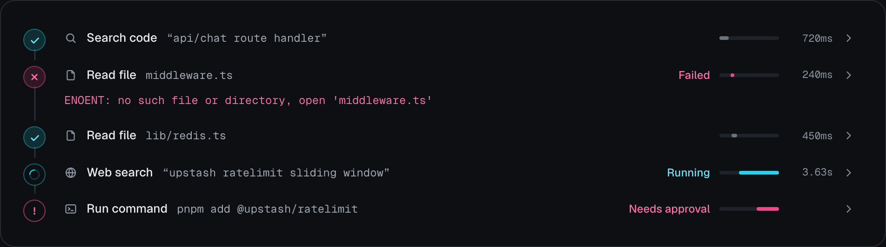
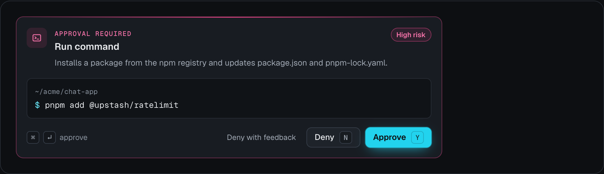
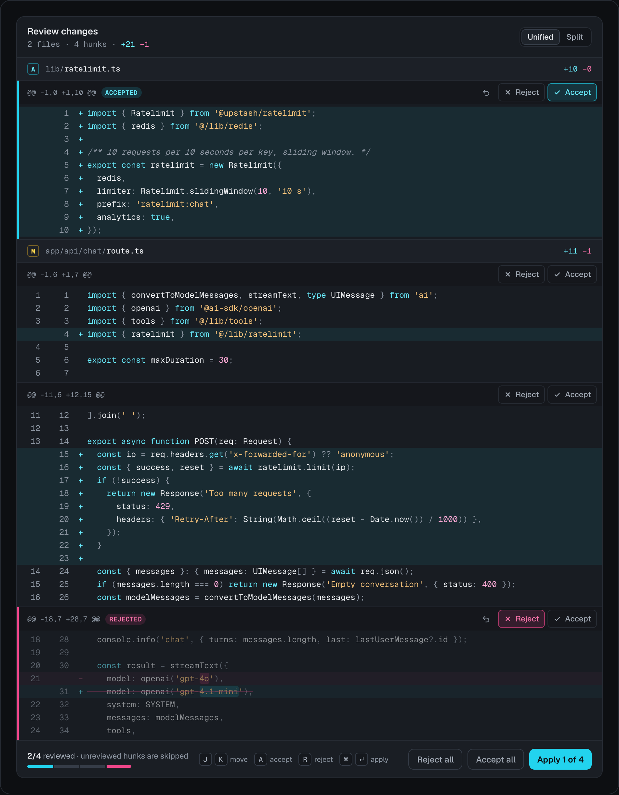
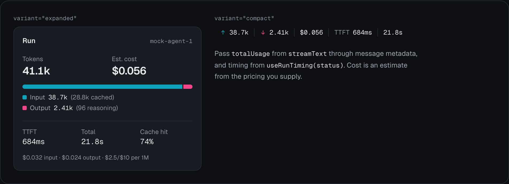
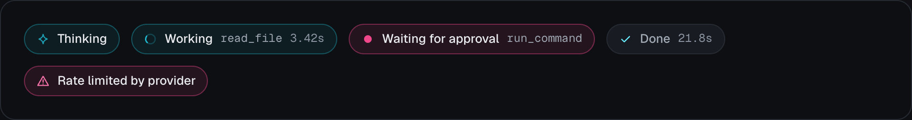
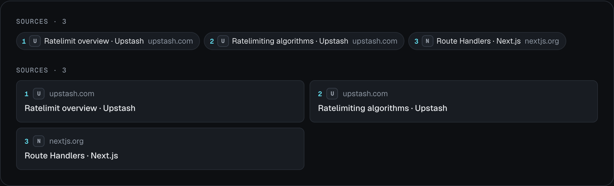
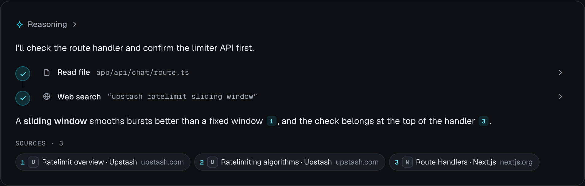
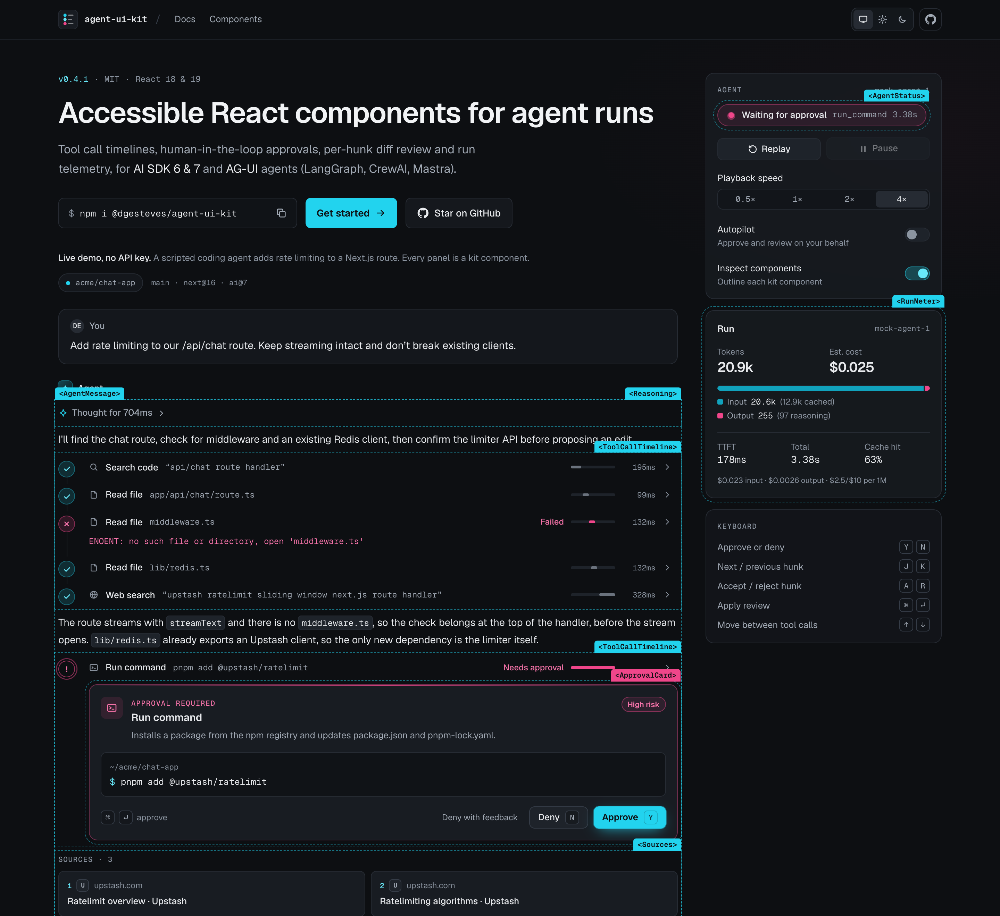
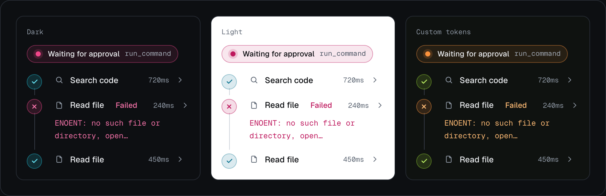

# agent-ui-kit

React components for the hard parts of agentic products: watching an agent work, approving what it does, reviewing what it changed, and understanding what the run cost.

[](https://github.com/dgesteves/agent-ui-kit/actions/workflows/ci.yml)
[](https://www.npmjs.com/package/@dgesteves/agent-ui-kit)
[](./LICENSE)


Typed against AI SDK v7 `UIMessage` parts. Ships as an npm package with a precompiled stylesheet, and as a shadcn registry. Keyboard-first, screen-reader announced, and audited with axe in jsdom and in a real browser.

<p align="center">
  
  <br>
  <sub>A full run in the playground, driven from the keyboard: <kbd>Y</kbd> approves the install, <kbd>A</kbd>/<kbd>R</kbd> review hunks, <kbd>Ctrl</kbd>+<kbd>↵</kbd> applies.</sub>
</p>

## Why it exists

Most AI UI libraries are built around the chat bubble. Agents changed what the interface has to do. A single run can call a dozen tools, stop to ask permission before something risky, propose edits across several files, and burn through tens of thousands of tokens. The questions users actually have are run-level ones:

- **What is it doing right now, and what already happened?** Which calls ran, in what order, how long each took, which ones failed and why.
- **Should I let it do that?** What exactly will run, how risky it is, and a fast, keyboard-friendly way to say yes, no, or no with a reason.
- **What did it change, and do I accept it?** Hunk by hunk, not all or nothing, with the result fed back to the agent.
- **What did that cost?** Tokens, cache efficiency, time to first token, and time actually spent working rather than waiting on you.

`agent-ui-kit` is a focused set of components for those surfaces. It renders the parts `useChat` already gives you, so it slots into an AI SDK app without a new runtime or state model.

## Quickstart

### npm

```bash
pnpm add @dgesteves/agent-ui-kit ai
```

Styles, either way:

```css
/* Tailwind CSS v4: tokens, theme mapping and an @source for the components */
@import 'tailwindcss';
@import '@dgesteves/agent-ui-kit/tailwind.css';
```

```ts
// No Tailwind: a precompiled stylesheet with only the utilities the kit uses, and no global reset
import '@dgesteves/agent-ui-kit/styles.css';
```

Light is the default. Add `class="dark"` (or `data-theme="dark"`) to `<html>` or any ancestor for the dark palette.

```tsx
'use client';

import { useChat } from '@ai-sdk/react';
import { lastAssistantMessageIsCompleteWithApprovalResponses, type LanguageModelUsage, type UIMessage } from 'ai';
import { AgentMessage, AgentStatus, RunMeter, deriveAgentState, useRunTiming } from '@dgesteves/agent-ui-kit';

type Message = UIMessage<{ usage?: LanguageModelUsage }>;

export function AgentRun() {
  const { messages, status, addToolApprovalResponse } = useChat<Message>({
    // Continue the run as soon as every pending approval has an answer.
    sendAutomaticallyWhen: lastAssistantMessageIsCompleteWithApprovalResponses,
  });
  const last = messages.findLast((m) => m.role === 'assistant');
  const { state, detail } = deriveAgentState({ status, message: last });
  const timing = useRunTiming(status);

  return (
    <div className="dark flex flex-col gap-4">
      <AgentStatus state={state} detail={detail} elapsedMs={timing.activeMs} />
      {last && (
        <AgentMessage
          message={last}
          streaming={status === 'streaming'}
          // Once the run has finished, been stopped or failed, calls that never settled read "Stopped".
          active={state !== 'done' && state !== 'error'}
          onToolApproval={addToolApprovalResponse}
        />
      )}
      <RunMeter
        usage={last?.metadata?.usage}
        pricing={{ input: 2.5, cachedInput: 0.25, output: 10 }}
        ttftMs={timing.ttftMs}
        durationMs={timing.activeMs}
      />
    </div>
  );
}
```

On the server, request approval for risky tools and send usage as message metadata:

```ts
import { addUsage } from '@dgesteves/agent-ui-kit/core';
import { convertToModelMessages, streamText, type LanguageModelUsage, type UIMessage } from 'ai';

type Message = UIMessage<{ usage?: LanguageModelUsage }>;

export async function POST(req: Request) {
  const { messages }: { messages: Message[] } = await req.json();
  const result = streamText({
    model,
    messages: await convertToModelMessages(messages, { tools }),
    tools,
    toolApproval: { run_command: { type: 'user-approval', reason: 'Runs a shell command in the repository.' } },
  });

  // Once approved, the run continues the same message in a new request whose totalUsage starts
  // from zero, and useChat replaces metadata.usage. Add the usage the message already has
  // (it comes back from the client, so it is fine for display but not for billing).
  const last = messages.at(-1);
  const previous = last?.role === 'assistant' ? last.metadata?.usage : undefined;

  return result.toUIMessageStreamResponse({
    originalMessages: messages,
    messageMetadata: ({ part }) =>
      part.type === 'finish' ? { usage: addUsage(previous, part.totalUsage) } : undefined,
  });
}
```

The `reason` shows up on the approval card as `approval.requestReason`. Without `addUsage`, the meter would show only the last request of a run that paused for approval.

#### Server Components

Components and hooks are client modules: each one carries its own `'use client'` directive, so you can render them from a Server Component. The pure helpers (`applyHunks`, `parseFileChange`, `computeReviewResult`, `estimateCost`, `formatCost`, `deriveAgentState` and the rest) are not, so Server Components and Route Handlers can call them. Import them from the main entry, or from `@dgesteves/agent-ui-kit/core`, which contains only the helpers and their types and no React:

```ts
// app/api/review/route.ts
import { applyHunks, parseFileChange } from '@dgesteves/agent-ui-kit/core';
```

### shadcn registry

Every component is also a self-contained registry item: the component, the helpers it imports, its npm dependencies, and the theme tokens as `cssVars`. Files land in `components/agent-ui/` with their relative imports intact.

```bash
# Straight from this repository
npx shadcn@latest add dgesteves/agent-ui-kit/tool-call-timeline

# Or from wherever the playground is deployed (it serves /r/*.json)
npx shadcn@latest add https://<playground-host>/r/tool-call-timeline.json
```

Items: `agent-message`, `tool-call-timeline`, `approval-card`, `diff-review`, `run-meter`, `agent-status`, `sources`, `markdown`, `reasoning`. Installing a second item skips the shared files it already added. Component and hook files start with `'use client'`, so they work when rendered from Server Components; the helpers in `lib/` (`diff.ts`, `usage.ts`, `ai.ts`, `format.ts`) do not, so the server can call them.

## Components

### `ToolCallTimeline`



Every AI SDK v7 tool state (`input-streaming`, `input-available`, `approval-requested`, `approval-responded`, `output-available` including `preliminary`, `output-error`, `output-denied`) with live durations, a waterfall that makes parallel calls visible, and expandable input and output. Failures show their error inline. Calls are disclosure buttons: <kbd>↑</kbd> <kbd>↓</kbd> <kbd>Home</kbd> <kbd>End</kbd> move between them, and settled calls are announced. Pass `active={false}` once the run has ended (stopped, failed, or restored from history), so calls that never settled read "Stopped" instead of counting up forever.

```tsx
<ToolCallTimeline
  parts={message.parts}
  tools={{
    // Input can be partial while it streams.
    read_file: { label: 'Read file', icon: <FileIcon />, summary: (input) => (input as { path?: string }).path },
    run_command: { risk: 'high' },
  }}
/>
```

### `ApprovalCard`



Human-in-the-loop approval with a risk level, a command or argument preview, and deny-with-feedback. <kbd>Y</kbd> and <kbd>N</kbd> work while focus is in the card; <kbd>⌘</kbd>/<kbd>Ctrl</kbd>+<kbd>↵</kbd> approves, optionally page-wide. `critical` actions need a second, confirming press. `ToolApprovalCard` binds it to a tool part and to `addToolApprovalResponse`, including the denial reason. Decisions that a `toolApproval` policy makes on its own (`approval.isAutomatic`) never prompt or take focus, and read "Auto-approved" or "Blocked by policy" rather than as a person's decision.

```tsx
<ToolApprovalCard part={part} onRespond={addToolApprovalResponse} risk="high" autoFocus />
```

### `DiffReview`



Unified or split review of agent edits with word-level highlights and per-hunk accept/reject. <kbd>J</kbd>/<kbd>K</kbd> move, <kbd>A</kbd>/<kbd>R</kbd> decide (and advance), <kbd>U</kbd> resets, <kbd>⇧A</kbd>/<kbd>⇧R</kbd> decide everything, <kbd>⌘</kbd>/<kbd>Ctrl</kbd>+<kbd>↵</kbd> applies. `onSubmit` receives each file with only the accepted hunks applied, so it works as a client-side tool result.

```tsx
<DiffReview
  files={[{ path: 'app/api/chat/route.ts', oldContent, newContent }]}
  onSubmit={(result) => addToolOutput({ tool: 'review_changes', toolCallId, output: result })}
/>
```

### `RunMeter`



Tokens in and out, estimated cost, time to first token, active run time and prompt-cache hit rate. Takes the AI SDK `LanguageModelUsage` shape directly; to cover a whole run across approval round trips, sum it on the server with `addUsage` as in the [server recipe](#npm). `useRunTiming(status)` measures TTFT and active time across approval round-trips, excluding time spent waiting on the user. `pricing` is in USD per million tokens: `input` and `output`, plus optional `cachedInput` for cache reads and `cacheWrite` for cache writes (1.25× input on Anthropic, for example), which both default to `input`.

```tsx
<RunMeter
  variant="expanded"
  usage={usage}
  pricing={{ input: 2.5, cachedInput: 0.25, output: 10 }}
  ttftMs={ttft}
  durationMs={active}
  live
/>
```

### `AgentStatus`



Thinking, working, waiting for approval, done or error, with an elapsed timer. Changes are announced through a live region: debounced so quick flips are not read out one by one, and assertive only for approvals and errors. `deriveAgentState` maps `useChat` status and the latest message to a state, with human-in-the-loop waits taking precedence.

```tsx
<AgentStatus {...deriveAgentState({ status, message: last, pendingClientTools: ['review_changes'] })} />
```

### `Sources`



`source-url` and `source-document` parts as numbered chips or cards. In `AgentMessage`, `[n]` markers in the text become links to the matching source.

```tsx
<Sources sources={getSourceParts(message.parts)} variant="cards" />
```

### `AgentMessage`



A whole assistant `UIMessage`, part by part: streaming-safe markdown (unterminated syntax is closed while streaming, raw HTML is never rendered, `javascript:` and `data:` URLs are stripped), collapsible reasoning that summarizes how long the model thought, consecutive tool parts grouped into one timeline with inline approval cards, files, `data-*` parts through `renderData`, and sources. `renderTool` lets you take over any tool part, as the playground does for `review_changes`.

```tsx
<AgentMessage
  message={last}
  streaming={status === 'streaming'}
  tools={toolMeta}
  onToolApproval={addToolApprovalResponse}
  renderTool={(part) => (getToolPartName(part) === 'review_changes' ? <MyReview part={part} /> : undefined)}
/>
```

Images in text and reasoning do not load unless their host is allowed: a URL in model output can carry data out of the conversation as soon as the browser fetches it (``), so by default an image renders as a link with its alt text. Allow the hosts you trust, or `'*'` for any:

```tsx
<AgentMessage message={last} allowedImageHosts={['images.example.com']} />
```

`Markdown`, `Reasoning` and `JsonView` are exported on their own as well, and `Markdown` and `Reasoning` take the same `allowedImageHosts`.

## How it maps to AI SDK message parts



| AI SDK v7                                                      | Rendered as                                                                                 |
| -------------------------------------------------------------- | ------------------------------------------------------------------------------------------- |
| `text` (`state: 'streaming' \| 'done'`)                        | `Markdown`, repaired while streaming, with a caret and `[n]` citation links                 |
| `reasoning`                                                    | `Reasoning`: open while streaming, then "Thought for 1.7s"                                  |
| `tool-*` / `dynamic-tool`, `input-streaming`                   | Timeline row "Preparing", partial input visible                                             |
| `input-available`                                              | "Running", live duration ("Stopped" once the run is no longer `active`)                     |
| `approval-requested` (`approval.id`, `approval.requestReason`) | "Needs approval" + `ToolApprovalCard` → `addToolApprovalResponse({ id, approved, reason })` |
| `approval-responded`                                           | "Running" if approved, "Denied" if not                                                      |
| `output-available` (`preliminary: true`)                       | "Running", partial output                                                                   |
| `output-available`                                             | Done, output in a JSON view or your `renderOutput`                                          |
| `output-error` (`errorText`)                                   | "Failed", error inline, announced                                                           |
| `output-denied`                                                | "Denied", with the user's reason, or "Blocked by policy" when `approval.isAutomatic`        |
| client-side tool `input-available`                             | Whatever `renderTool` returns, e.g. `DiffReview` → `addToolOutput`                          |
| `source-url` / `source-document`                               | `Sources`                                                                                   |
| `file`                                                         | Image preview or file link                                                                  |
| `data-*`                                                       | `renderData`                                                                                |
| `message.metadata.usage` (`LanguageModelUsage`)                | `RunMeter`                                                                                  |
| `useChat().status`                                             | `AgentStatus` via `deriveAgentState`, timing via `useRunTiming`                             |

The kit depends on `ai` for types only. Part detection (`isToolPart`, `getToolPartName`) mirrors the SDK's runtime helpers, and a test checks they agree.

The playground does not fake any of this. Its scripted agent is a `ChatTransport` that streams real `UIMessageChunk`s through `useChat`, so the SDK assembles parts, merges usage metadata, and drives the approval and client-tool round trips exactly as it would against a server. The [live mode](examples/playground/app/api/chat/route.ts) runs the same tools against a real model with `streamText` when `OPENAI_API_KEY` is set.

## Accessibility

- **Keyboard first.** Every action is a real button. Single-key shortcuts (Y/N, J/K/A/R/U) only fire while focus is inside the component, which keeps them compliant with WCAG 2.1.4 and out of the way of text fields. They are exposed through `aria-keyshortcuts` and described in visually hidden text. The page-wide <kbd>⌘</kbd>/<kbd>Ctrl</kbd>+<kbd>↵</kbd> approval is opt-in because it collides with most chat composers.
- **Focus is managed, never lost.** Deciding an approval moves focus to the card instead of dropping it on `<body>`. Diff hunks use a roving tabindex, so the review is one tab stop that arrow and letter keys navigate. Tool calls follow the disclosure pattern with arrow-key movement.
- **Announcements.** Tool completions and failures, approval decisions, review progress ("Hunk 2 of 4 accepted. 2 remaining.") and agent state changes go through live regions. State announcements are debounced, and only approvals and errors are assertive.
- **Not color alone.** Every state has an icon and text, diff lines keep their +/− glyphs plus "Added:"/"Removed:" for screen readers, and risk levels are spelled out.
- **Motion.** All animation is behind `motion-safe`, and the number tweening in `RunMeter` honours `prefers-reduced-motion`.
- **Contrast.** A unit test parses the theme and enforces 4.5:1 for every text token pair and 3:1 for UI and chart marks, in both themes. The chart colors were run through a color-vision-deficiency check.
- **Document outline.** Titles take a `headingLevel`; source lists are labelled lists rather than landmarks, so a long conversation does not flood landmark navigation.
- **Tested.** Every component has axe checks in Vitest (jsdom). `pnpm a11y` also runs axe in Chrome against the playground at each stage of a run, the gallery and a phone viewport, which covers color contrast with real layout. Both currently report no violations.

## Theming

Everything is a CSS variable. Override on `:root`, on `.dark`, or on any subtree:

```css
:root {
  --aui-accent: #7c3aed; /* fills: buttons, running state, focus */
  --aui-accent-fg: #6d28d9; /* accent text */
  --aui-hot: #c2410c; /* attention: approvals, errors, deletions */
  --aui-radius: 6px;
  --aui-font-sans: var(--font-inter);
}
```



| Token group                                                             | Purpose                                       |
| ----------------------------------------------------------------------- | --------------------------------------------- |
| `--aui-bg`, `--aui-surface`, `--aui-surface-2`, `--aui-border(-strong)` | Surfaces and lines                            |
| `--aui-fg`, `--aui-fg-muted`, `--aui-fg-subtle`                         | Text, all AA on every surface                 |
| `--aui-accent`, `--aui-accent-fg`, `--aui-on-accent`, `--aui-ring`      | Activity, primary actions, focus              |
| `--aui-hot`, `--aui-hot-fg`, `--aui-on-hot`, `--aui-warn(-fg)`          | Attention, risk, errors                       |
| `--aui-add-bg`, `--aui-add-strong`, `--aui-del-bg`, `--aui-del-strong`  | Diff lines and word highlights                |
| `--aui-chart-input`, `--aui-chart-output`                               | Token bar                                     |
| `--aui-code-*`                                                          | Syntax tinting                                |
| `--aui-radius`, `--aui-font-sans`, `--aui-font-mono`                    | Shape and type (Geist when `geist` is loaded) |

In a shadcn/ui app you can point the kit at your existing tokens, for example `--aui-surface: var(--card)`, `--aui-border: var(--border)`, `--aui-radius: var(--radius)`. Components also accept `className` (merged with `tailwind-merge`) and expose `data-slot` and state attributes (`data-phase`, `data-state`, `data-decision`, `data-risk`) for styling hooks.

## Design decisions

- **A run, not a message.** The unit of UI is the run: many tool calls, a pause for permission, a review, a summary. Consecutive tool parts become one timeline instead of a stack of cards, and status and telemetry live outside the message.
- **Timings are measured, not invented.** `UIMessage` parts carry no timestamps, so `useToolTimings` records state transitions on the client. Execution time starts when a call is approved, not when it was proposed, so waiting on a human never reads as a slow tool. Calls that are already settled when first seen (restored history) get no duration rather than a fake zero. You can pass server-measured `timings` instead.
- **Errors inline, details on demand.** A failed call shows its message under the row and stays collapsed. Auto-expanding failures (`expandErrors`) pushed everything else off screen.
- **Cyan and magenta diffs, not green and red.** They match the brand and stay distinguishable under the common red-green color-vision deficiencies. The +/− glyphs and screen-reader prefixes carry the meaning regardless of color.
- **Review returns code.** `DiffReview` does not stop at a decision map: `onSubmit` includes each file with only the accepted hunks applied (`applyHunks`), and unreviewed hunks are skipped. That makes it usable as a client-side tool whose result goes straight back to the model.
- **Cache hit rate over tokens per second.** Throughput looked precise but mixed tool time into generation speed. For agents, cached input is the bigger cost lever, so that is what the meter shows.
- **Shortcuts scoped to focus.** Global single-key shortcuts are an accessibility problem and fight with text inputs; scoping them to the component avoids both. Critical approvals require a second press.
- **Hydration-safe clocks.** Live durations and waterfall widths render after hydration, so server and client markup always match.
- **Type-only dependency on `ai`.** No SDK runtime in the bundle (about 29 kB gzipped, dependencies external), while props stay typed to SDK parts.
- **Two distribution channels from one source.** The npm build ships precompiled CSS for apps without Tailwind. The registry is generated from the same files by `scripts/registry.mjs`, which computes each item's file closure from its imports, so items install by URL or from GitHub without cross-item dependencies. CI fails if `registry.json` drifts.

## Why not AI Elements or assistant-ui?

Both are good, and you may well want one of them for the chat shell.

- **[AI Elements](https://github.com/vercel/ai-elements)** is Vercel's shadcn registry for AI SDK apps, with a broad set of components: conversation, message, prompt input, reasoning, sources, a per-call `Tool` card, a `Confirmation` for tool approvals, a `Context` usage indicator, and more. If you want the widest coverage of the message surface in shadcn style, start there.
- **[assistant-ui](https://github.com/assistant-ui/assistant-ui)** is a chat runtime plus composable primitives (thread, composer, message) with adapters for the AI SDK, LangGraph and custom backends, including tool UIs and approvals. If you need a full chat product with threads, branching and attachments, it covers far more ground.

This kit goes deeper on a narrower slice, the run around the conversation:

- **A timeline, not a card per call**, with measured durations that exclude approval waits, a waterfall that shows parallelism, keyboard movement between calls and announced completions.
- **Approvals with judgement**: risk levels, a command preview, deny-with-reason routed to `addToolApprovalResponse`, focus-scoped shortcuts and two-step confirmation for critical actions.
- **Hunk-level diff review that returns the applied files**. I did not find an equivalent in either library when this was written.
- **Run telemetry across round trips**: TTFT and active time over approval and client-tool continuations, cache hit rate and a cost breakdown, rather than a single request's context window.
- **No framework buy-in**: plain props over `UIMessage` parts, an npm package that works without Tailwind or shadcn, or registry items if you prefer to own the code.

They compose: render the thread with either library and drop these components into tool parts and side panels.

## Roadmap

- Nested runs: sub-agent calls rendered as collapsible child timelines
- Virtualized timelines and block-memoized markdown for very long runs
- A pluggable highlighter (Shiki) and multi-line syntax state in diffs and code blocks
- Diff review: line-level selection, inline comments to the agent, rename and binary-file handling
- Server-reported timings through `data-*` parts, so durations survive reloads
- Localized strings and RTL layout
- Visual regression tests for every component state

## Development

```bash
pnpm install
pnpm dev          # library in watch mode + playground on http://localhost:3100
pnpm test         # Vitest + Testing Library + vitest-axe
pnpm lint         # ESLint (typescript-eslint, react-hooks, jsx-a11y strict) with zero warnings
pnpm typecheck
pnpm build        # library, shadcn registry, playground
pnpm a11y         # axe in Chrome against the running playground
pnpm media        # regenerate docs/media (Chrome and ffmpeg required)
```

```
packages/agent-ui-kit/   the library: src/ (components + lib/), test/, tsdown + Tailwind CSS build
examples/playground/     Next.js 16 showpiece: scripted ChatTransport, gallery, optional live mode
registry.json            shadcn registry, generated by scripts/registry.mjs
scripts/                 registry generator, media capture, real-browser accessibility audit
```

Releases use [Changesets](https://github.com/changesets/changesets): add one with `pnpm changeset`; merging the version PR publishes to npm with provenance.

## License

[MIT](./LICENSE) © Diogo Esteves
