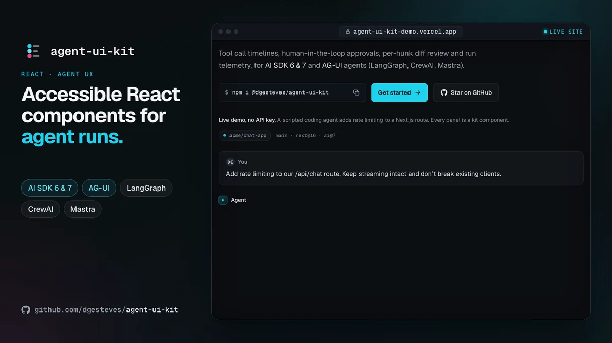

# agent-ui-kit

React components for the hard parts of agentic products: watching an agent work, approving what it does, reviewing what it changed, and understanding what the run cost. For AI SDK 6 & 7 and AG-UI.

[](https://github.com/dgesteves/agent-ui-kit/actions/workflows/ci.yml)
[](https://www.npmjs.com/package/@dgesteves/agent-ui-kit)
[](./LICENSE)

**[Open the live playground →](https://agent-ui-kit-demo.vercel.app)** A scripted agent run with replay, speed and keyboard controls. No API key needed. **[Read the docs →](https://agent-ui-kit-demo.vercel.app/docs)** Getting started, AG-UI agents, and a page per component with its props, keyboard and theming hooks. For coding agents, the docs are also at [`/llms.txt`](https://agent-ui-kit-demo.vercel.app/llms.txt) and [`/llms-full.txt`](https://agent-ui-kit-demo.vercel.app/llms-full.txt), and every page as Markdown at its URL plus `.md`.

<!-- npm-readme:video -->

https://github.com/user-attachments/assets/eb7c6a77-555f-4f6e-badf-230ebeeba45e

<sub>The <a href="https://agent-ui-kit-demo.vercel.app">playground</a>, driven from the keyboard: tool calls stream into the timeline, <kbd>Y</kbd> approves the install, <kbd>A</kbd>/<kbd>R</kbd> review hunks, <kbd>Ctrl</kbd>+<kbd>↵</kbd> applies. Then the <a href="https://agent-ui-kit-demo.vercel.app/gallery#ag-ui">AG-UI demo</a>, a real <code>@ag-ui/client</code> agent that resumes once you approve.</sub>

<!-- npm-readme:image
<p align="center">
  <a href="https://agent-ui-kit-demo.vercel.app"></a>
</p>

<sub>The <a href="https://agent-ui-kit-demo.vercel.app">playground</a>, driven from the keyboard: tool calls stream into the timeline, <kbd>Y</kbd> approves the install, <kbd>A</kbd>/<kbd>R</kbd> review hunks, <kbd>Ctrl</kbd>+<kbd>↵</kbd> applies. Then the <a href="https://agent-ui-kit-demo.vercel.app/gallery#ag-ui">AG-UI demo</a>, a real <code>@ag-ui/client</code> agent that resumes once you approve.</sub>
-->

Typed against AI SDK 6 and 7 `UIMessage` parts (`ai@^6.0.0 || ^7.0.102`), runs on React 18 and 19 (`react@^18.2.0 || ^19.0.0`), and tested against each in CI. [AG-UI](#ag-ui-agents) agents (LangGraph, CrewAI, Mastra, Pydantic AI and the rest of the protocol's integrations) render through an adapter. Ships as an npm package with a precompiled stylesheet, and as a shadcn registry. Keyboard-first, screen-reader announced, and audited with axe in jsdom and in a real browser.

**Any model, nothing extra to pay.** The kit calls no model, needs no API key and makes no network requests of its own: it renders what your agent streams. Your backend picks the model and holds the keys, so it works with OpenAI GPT, Anthropic Claude, Google Gemini, xAI Grok, Mistral or a local model through any AI SDK provider, and with any AG-UI framework (LangGraph, CrewAI, Mastra and the rest). Switching providers is one line in your route; the components don't change.

## Why it exists

Most AI UI libraries are built around the chat bubble. Agents changed what the interface has to do. A single run can call a dozen tools, stop to ask permission before something risky, propose edits across several files, and burn through tens of thousands of tokens. The questions users actually have are run-level ones:

- **What is it doing right now, and what already happened?** Which calls ran, in what order, how long each took, which ones failed and why.
- **Should I let it do that?** What exactly will run, how risky it is, and a fast, keyboard-friendly way to say yes, no, or no with a reason.
- **What did it change, and do I accept it?** Hunk by hunk, not all or nothing, with the result fed back to the agent.
- **What did that cost?** Tokens, cache efficiency, time to first token, and time actually spent working rather than waiting on you.

`agent-ui-kit` is a focused set of components for those surfaces. It renders the parts `useChat` already gives you, so it slots into an AI SDK app without a new runtime or state model.

## Quickstart

A Next.js App Router app with AI SDK 7: a client component, a page and a route. **[The quickstart, running](examples/nextjs-minimal)** is this section as an app, against a scripted model, so it needs no API key.

### npm

```bash
pnpm add @dgesteves/agent-ui-kit ai @ai-sdk/react @ai-sdk/openai zod
```

Styles, either way:

```css
/* Tailwind CSS v4: tokens, theme mapping and an @source for the components */
@import 'tailwindcss';
@import '@dgesteves/agent-ui-kit/tailwind.css';
```

```ts
// Tailwind v3 or no Tailwind: a precompiled stylesheet with only the utilities the kit uses, and no global reset
import '@dgesteves/agent-ui-kit/styles.css';
```

`styles.css` has no cascade layers, so Tailwind v3 builds accept it and a global reset such as `* { padding: 0 }` cannot strip the components' spacing. Every rule in it is scoped to the components' own elements, so it does not restyle your app; import it after your global CSS. `styles.layered.css` is the same stylesheet in `@layer theme, base, utilities`, for apps that order their CSS with layers.

Light is the default. Add `class="dark"` (or `data-theme="dark"`) to `<html>` or any ancestor for the dark palette. To follow the OS setting instead, import `@dgesteves/agent-ui-kit/theme.auto.css` after the stylesheet; `class="light"` (or `data-theme="light"`) on `<html>` still forces the light palette.

The client renders the last assistant message, its status and its cost, with a minimal composer. The wrapper paints the kit's own background and text colors (`bg-aui-bg text-aui-fg`), so the run reads well whatever the page's colors are. The class names are Tailwind; without it, give the wrapper `background: var(--aui-bg); color: var(--aui-fg)` and style the form your own way.

```tsx
// app/agent-run.tsx
'use client';

import { useChat } from '@ai-sdk/react';
import { lastAssistantMessageIsCompleteWithApprovalResponses, type LanguageModelUsage, type UIMessage } from 'ai';
import { useState } from 'react';
import { AgentMessage, AgentStatus, RunMeter, deriveAgentState, useRunTiming } from '@dgesteves/agent-ui-kit';

type Message = UIMessage<{ usage?: LanguageModelUsage }>;

export function AgentRun() {
  const { messages, status, sendMessage, addToolApprovalResponse } = useChat<Message>({
    // Continue the run as soon as every pending approval has an answer.
    sendAutomaticallyWhen: lastAssistantMessageIsCompleteWithApprovalResponses,
  });
  const [input, setInput] = useState('');
  const last = messages.findLast((m) => m.role === 'assistant');
  const { state, detail } = deriveAgentState({ status, message: last });
  // A run starts with each message you send and spans its approval round trips.
  const timing = useRunTiming(status, messages);

  return (
    // The kit's own background and text colors, so it reads well on any page. Add `dark` for the dark theme.
    <div className="bg-aui-bg text-aui-fg mx-auto flex max-w-2xl flex-col gap-4 p-6">
      <AgentStatus state={state} detail={detail} elapsedMs={timing.activeMs} />
      {last && (
        <AgentMessage
          message={last}
          streaming={status === 'streaming'}
          // Once the run has finished, been stopped or failed, calls that never settled read "Stopped".
          active={state !== 'done' && state !== 'stopped' && state !== 'error'}
          onToolApproval={addToolApprovalResponse}
        />
      )}
      <RunMeter
        usage={last?.metadata?.usage}
        pricing={{ input: 2.5, cachedInput: 0.25, output: 10 }}
        ttftMs={timing.ttftMs}
        durationMs={timing.activeMs}
      />
      <form
        className="flex gap-2"
        onSubmit={(event) => {
          event.preventDefault();
          if (!input.trim()) return;
          void sendMessage({ text: input });
          setInput('');
        }}
      >
        <input
          aria-label="Message the agent"
          placeholder="Ask the agent to change something"
          value={input}
          onChange={(event) => setInput(event.target.value)}
          className="border-aui-border bg-aui-surface flex-1 rounded-lg border px-3 py-2 text-sm"
        />
        <button
          type="submit"
          disabled={status !== 'ready' && status !== 'error'}
          className="bg-aui-accent text-aui-on-accent rounded-lg px-4 text-sm font-medium disabled:opacity-50"
        >
          Send
        </button>
      </form>
    </div>
  );
}
```

Render it from a page. On Next.js 16 with `cacheComponents`, on in new apps, the page needs a `<Suspense>` boundary around it:

```tsx
// app/page.tsx
import { Suspense } from 'react';
import { AgentRun } from './agent-run';

export default function Page() {
  // With cacheComponents (on in new Next.js 16 apps), useChat needs a Suspense boundary:
  // it creates ids with Math.random(), which Next.js does not allow in prerendered output.
  return (
    <Suspense>
      <AgentRun />
    </Suspense>
  );
}
```

On the server, give the model tools, ask for approval before the risky one, and send usage as message metadata:

```ts
// app/api/chat/route.ts
import { openai } from '@ai-sdk/openai';
import { addUsage } from '@dgesteves/agent-ui-kit/core';
import { convertToModelMessages, stepCountIs, streamText, tool, type LanguageModelUsage, type UIMessage } from 'ai';
import { z } from 'zod';

type Message = UIMessage<{ usage?: LanguageModelUsage }>;

// A pretend repository, so nothing touches your disk or shell.
const FILES: Record<string, string> = {
  'app/api/chat/route.ts': 'export async function POST(req: Request) {\n  // ...\n}\n',
};

const tools = {
  read_file: tool({
    description: 'Read a file from the repository.',
    inputSchema: z.object({ path: z.string() }),
    execute: async ({ path }) => {
      const content = FILES[path];
      if (content === undefined) throw new Error(`ENOENT: no such file or directory, open '${path}'`);
      return { path, content };
    },
  }),
  run_command: tool({
    description: 'Run a shell command in the repository.',
    inputSchema: z.object({ command: z.string() }),
    execute: async ({ command }) => ({ exitCode: 0, stdout: `(simulated) ${command}` }),
  }),
};

export async function POST(req: Request) {
  const { messages }: { messages: Message[] } = await req.json();
  const result = streamText({
    model: openai('gpt-5.4-mini'),
    messages: await convertToModelMessages(messages, { tools }),
    tools,
    // Ask before running commands. The reason shows on the approval card.
    toolApproval: { run_command: { type: 'user-approval', reason: 'Runs a shell command in the repository.' } },
    // Keep going after tool calls: the AI SDK stops after the first step by default.
    stopWhen: stepCountIs(10),
  });

  // Once approved, the run continues the same message in a new request whose totalUsage starts
  // from zero, and useChat replaces metadata.usage. Add the usage the message already has
  // (it comes back from the client, so it is fine for display but not for billing).
  const last = messages.at(-1);
  const previous = last?.role === 'assistant' ? last.metadata?.usage : undefined;

  return result.toUIMessageStreamResponse({
    originalMessages: messages,
    sendSources: true,
    messageMetadata: ({ part }) =>
      part.type === 'finish' ? { usage: addUsage(previous, part.totalUsage) } : undefined,
    // Failed tool calls show this text. The default hides every error as "An error occurred.".
    onError: (error) => (error instanceof Error ? error.message : 'An error occurred.'),
  });
}
```

- **`stopWhen`.** The AI SDK stops after one step by default, so without it the run ends with the first tool call and never reaches the approval.
- **`toolApproval`.** The `reason` shows up on the approval card as `approval.requestReason`.
- **`addUsage`.** Without it, the meter would show only the last request of a run that paused for approval.
- **`onError`.** A tool that throws becomes an `output-error` part, and its `errorText` goes through `onError`, which by default hides every message behind "An error occurred.", so the timeline would show that instead of `ENOENT: no such file or directory`. The quickstart shows every error's message; in production, show the ones you are happy for users to read and keep the rest generic.

**Any provider.** The model is the one line to change: `anthropic('claude-sonnet-5-5')` from `@ai-sdk/anthropic`, `google('gemini-3.5-flash')` from `@ai-sdk/google`, `xai('grok-4.7')` from `@ai-sdk/xai`, or any other [AI SDK provider](https://ai-sdk.dev/providers/ai-sdk-providers), each with its own API key in your environment. The client and the components stay as they are. [Choosing a model](https://agent-ui-kit-demo.vercel.app/docs/getting-started#choosing-a-model) has the table, local models included.

**AI SDK 6.** Install `ai@^6 @ai-sdk/react@^3 @ai-sdk/openai@^3`. `toolApproval` is an AI SDK 7 option: on 6, drop it and mark the tool instead. The rest is the same.

```ts
run_command: tool({
  description: 'Run a shell command in the repository.',
  inputSchema: z.object({ command: z.string() }),
  needsApproval: true,
  execute: async ({ command }) => ({ exitCode: 0, stdout: `(simulated) ${command}` }),
}),
```

#### Server Components

Components and hooks are client modules with their own `'use client'` directive (except `Sources`, which has no state and renders on the server too), so you can render any of them from a Server Component. The pure helpers (`applyHunks`, `parseFileChange`, `computeReviewResult`, `estimateCost`, `formatCost`, `deriveAgentState` and the rest) are not, so Server Components and Route Handlers can call them. Import them from the main entry, or from `@dgesteves/agent-ui-kit/core`, which contains only the helpers and their types and no React:

```ts
// app/api/review/route.ts
import { applyHunks, parseFileChange } from '@dgesteves/agent-ui-kit/core';
```

### shadcn registry

Every component is also a self-contained registry item: the component, the helpers it imports, its npm dependencies, and the theme tokens as `cssVars`. Files land in `components/agent-ui/` with their relative imports intact.

```bash
npx shadcn@latest add @agent-ui-kit/agent-message
```

`@agent-ui-kit` is in the [shadcn registry directory](https://ui.shadcn.com/docs/directory), so the CLI finds it and adds it to your `components.json` on first use. The same items install by URL from the hosted registry (`npx shadcn@latest add https://agent-ui-kit-demo.vercel.app/r/agent-message.json`) or straight from this repository (`npx shadcn@latest add dgesteves/agent-ui-kit/agent-message`).

Items: `agent-message`, `tool-call-timeline`, `approval-card`, `diff-review`, `run-meter`, `agent-status`, `sources`, `markdown`, `reasoning`, and `ag-ui` (the [AG-UI adapter](#ag-ui-agents)). Installing a second item skips the shared files it already added. Component and hook files start with `'use client'` (`sources.tsx` needs none), so they work when rendered from Server Components; the helpers in `lib/` (`diff.ts`, `usage.ts`, `ai.ts`, `format.ts`) do not, so the server can call them. The files pass a new Next.js app's ESLint config with no warnings, which CI checks.

**From a coding agent.** The [shadcn MCP server](https://ui.shadcn.com/docs/mcp) lets Claude Code, Cursor, VS Code or Codex browse and install registry items. Set it up with `npx shadcn@latest mcp init --client claude` (or `cursor`, `vscode`), and make sure `components.json` lists the registry (the first `shadcn add @agent-ui-kit/...` adds it):

```json
{
  "registries": {
    "@agent-ui-kit": "https://agent-ui-kit-demo.vercel.app/r/{name}.json"
  }
}
```

Then ask for it by name, for example "add the agent-ui-kit approval card to the chat page". Agents can also read these docs from [`/llms.txt`](https://agent-ui-kit-demo.vercel.app/llms.txt).

## Components

### `ToolCallTimeline`

<picture>
  <source media="(prefers-color-scheme: light)" srcset="docs/media/components/tool-call-timeline-light.png">
  
</picture>

Every AI SDK tool state (`input-streaming`, `input-available`, `approval-requested`, `approval-responded`, `output-available` including `preliminary`, `output-error`, `output-denied`) with live durations, a waterfall that makes parallel calls visible, and expandable input and output. Failures show their error inline. Calls are disclosure buttons: <kbd>↑</kbd> <kbd>↓</kbd> <kbd>Home</kbd> <kbd>End</kbd> move between them, and settled calls are announced. Pass `active={false}` once the run has ended (stopped, failed, or restored from history), so calls that never settled read "Stopped" instead of counting up forever.

```tsx
import { ToolCallTimeline } from '@dgesteves/agent-ui-kit';
import { FileText } from 'lucide-react'; // or any icon: `icon` takes a ReactNode

<ToolCallTimeline
  parts={message.parts}
  tools={{
    // Input can be partial while it streams.
    read_file: {
      label: 'Read file',
      icon: <FileText size={14} />,
      summary: (input) => (input as { path?: string }).path,
    },
    run_command: { risk: 'high' },
  }}
/>;
```

### `ApprovalCard`

<picture>
  <source media="(prefers-color-scheme: light)" srcset="docs/media/components/approval-card-light.png">
  
</picture>

Human-in-the-loop approval with a command or argument preview, a risk level when you give one (without `risk`, no badge rather than a guess), and deny-with-feedback. <kbd>Y</kbd> and <kbd>N</kbd> work while focus is in the card; <kbd>⌘</kbd>/<kbd>Ctrl</kbd>+<kbd>↵</kbd> approves, optionally page-wide. `critical` actions need a second, confirming press. Each pending approval sends one decision: a double click, or <kbd>Y</kbd> then <kbd>N</kbd>, is ignored until `status` changes, the handler's promise settles or the handler throws. `ToolApprovalCard` binds it to a tool part and to `addToolApprovalResponse`, including the denial reason. Decisions that a `toolApproval` policy makes on its own (`approval.isAutomatic`) never prompt or take focus, and read "Auto-approved" or "Blocked by policy" rather than as a person's decision.

```tsx
<ToolApprovalCard part={part} onRespond={addToolApprovalResponse} risk="high" autoFocus />
```

### `DiffReview`

<picture>
  <source media="(prefers-color-scheme: light)" srcset="docs/media/components/diff-review-light.png">
  
</picture>

Unified or split review of agent edits with word-level highlights and per-hunk accept/reject. <kbd>J</kbd>/<kbd>K</kbd> move, <kbd>A</kbd>/<kbd>R</kbd> decide (and advance), <kbd>U</kbd> resets, <kbd>⇧A</kbd>/<kbd>⇧R</kbd> decide everything, <kbd>⌘</kbd>/<kbd>Ctrl</kbd>+<kbd>↵</kbd> applies. `onSubmit` receives each file with only the accepted hunks applied, so it works as a client-side tool result. It fires once per set of decisions: a double click or a repeated <kbd>⌘</kbd>/<kbd>Ctrl</kbd>+<kbd>↵</kbd> sends one review until a decision or the files change. Files compare by content, so an inline `files` array does not re-arm it.

```tsx
<DiffReview
  files={[{ path: 'app/api/chat/route.ts', oldContent, newContent }]}
  onSubmit={(result) => addToolOutput({ tool: 'review_changes', toolCallId, output: result })}
/>
```

### `RunMeter`

<picture>
  <source media="(prefers-color-scheme: light)" srcset="docs/media/components/run-meter-light.png">
  
</picture>

Tokens in and out, estimated cost, time to first token, active run time and prompt-cache hit rate. Takes the AI SDK `LanguageModelUsage` shape directly; to cover a whole run across approval round trips, sum it on the server with `addUsage` as in the [server recipe](#npm). `useRunTiming(status, messages)` measures TTFT and active time per turn: a run starts with each user message and spans its approval round trips, excluding time spent waiting on the user. Without `messages`, each request is timed on its own; TTFT is left unknown, not 0, for a run that was already streaming when the hook first saw it. `pricing` is in USD per million tokens: `input` and `output`, plus optional `cachedInput` for cache reads and `cacheWrite` for cache writes (1.25× input on Anthropic, for example), which both default to `input`.

```tsx
<RunMeter
  variant="expanded"
  usage={usage}
  pricing={{ input: 2.5, cachedInput: 0.25, output: 10 }}
  ttftMs={ttft}
  durationMs={active}
  live
/>
```

### `AgentStatus`

<picture>
  <source media="(prefers-color-scheme: light)" srcset="docs/media/components/agent-status-light.png">
  
</picture>

Thinking, working, waiting for approval, done, stopped or error, with an elapsed timer. Changes are announced through a live region: debounced so quick flips are not read out one by one, and assertive only for approvals and errors. `deriveAgentState` maps `useChat` status and the latest message to a state, with human-in-the-loop waits taking precedence. A run that ended with work unfinished, which is what `stop()` leaves behind (text or reasoning still streaming, a tool call still preparing or running), is `stopped` rather than `done`. Client-side tools change that. Name the ones the app runs itself (`onToolCall`, then `addToolOutput`) in `clientTools`: while one runs, `useChat` is `ready`, and the run reads `working` with the tool as its detail. Name the ones that wait on a person (a review) in `pendingClientTools`: they read `awaiting-approval`.

```tsx
<AgentStatus {...deriveAgentState({ status, message: last, pendingClientTools: ['review_changes'] })} />
```

### `Sources`

<picture>
  <source media="(prefers-color-scheme: light)" srcset="docs/media/components/sources-light.png">
  
</picture>

`source-url` and `source-document` parts as numbered chips or cards. In `AgentMessage`, `[n]` markers in the text become links to the matching source.

```tsx
<Sources sources={getSourceParts(message.parts)} variant="cards" />
```

### `AgentMessage`

<picture>
  <source media="(prefers-color-scheme: light)" srcset="docs/media/components/agent-message-light.png">
  
</picture>

A whole assistant `UIMessage`, part by part: streaming-safe markdown (unterminated syntax is closed while streaming, raw HTML is never rendered, `javascript:` and `data:` URLs are stripped), collapsible reasoning that summarizes how long the model thought, consecutive tool parts grouped into one timeline with inline approval cards, files, `data-*` parts through `renderData`, and sources. `renderTool` lets you take over any tool part, as the playground does for `review_changes`.

```tsx
<AgentMessage
  message={last}
  streaming={status === 'streaming'}
  tools={toolMeta}
  onToolApproval={addToolApprovalResponse}
  renderTool={(part) => (getToolPartName(part) === 'review_changes' ? <MyReview part={part} /> : undefined)}
/>
```

Images in text and reasoning do not load unless they are allowed: a URL in model output can carry data out of the conversation as soon as the browser fetches it (``), so by default an image renders as a link with its alt text, or as plain text inside the link it belongs to (a badge). `allowedImageHosts` takes:

- host names: `'images.example.com'` matches any port, `'localhost:3000'` only that port;
- `'self'`: relative URLs such as `/logo.png`, which load from your own origin. Protocol-relative URLs (`//host/x`) are not relative, and absolute URLs to your own site need their host listed. Relative requests carry your cookies, so allow `'self'` only if GET requests to your origin have no side effects;
- `'*'`: every image.

```tsx
import { AgentMessage } from '@dgesteves/agent-ui-kit';

const IMAGE_HOSTS = ['images.example.com', 'self'];

<AgentMessage message={last} allowedImageHosts={IMAGE_HOSTS} />;
```

The list is compared by value, so an inline array works as well: it does not re-render the finished text on every streamed delta. Image file parts follow the same list, except that `data:` and `blob:` URLs, which need no request, always preview.

`Markdown`, `Reasoning` and `JsonView` are exported on their own as well, and `Markdown` and `Reasoning` take the same `allowedImageHosts`.

## How it maps to AI SDK message parts


| AI SDK 6 / 7                                                   | Rendered as                                                                                 |
| -------------------------------------------------------------- | ------------------------------------------------------------------------------------------- |
| `text` (`state: 'streaming' \| 'done'`)                        | `Markdown`, repaired while streaming, with a caret and `[n]` citation links                 |
| `reasoning`                                                    | `Reasoning`: open while streaming, then "Thought for 1.7s"                                  |
| `tool-*` / `dynamic-tool`, `input-streaming`                   | Timeline row "Preparing", partial input visible                                             |
| `input-available`                                              | "Running", live duration ("Stopped" once the run is no longer `active`)                     |
| `approval-requested` (`approval.id`, `approval.requestReason`) | "Needs approval" + `ToolApprovalCard` → `addToolApprovalResponse({ id, approved, reason })` |
| `approval-responded`                                           | "Running" if approved, "Denied" if not                                                      |
| `output-available` (`preliminary: true`)                       | "Running", partial output                                                                   |
| `output-available`                                             | Done, output in a JSON view or your `renderOutput`                                          |
| `output-error` (`errorText`)                                   | "Failed", error inline, announced                                                           |
| `output-denied`                                                | "Denied", with the user's reason, or "Blocked by policy" when `approval.isAutomatic`        |
| client-side tool `input-available`                             | Whatever `renderTool` returns, e.g. `DiffReview` → `addToolOutput`                          |
| `source-url` / `source-document`                               | `Sources`                                                                                   |
| `file`                                                         | Image preview (`data:` and `blob:` URLs, or as `allowedImageHosts` allows) or file link     |
| `data-*`                                                       | `renderData`                                                                                |
| `message.metadata.usage` (`LanguageModelUsage`)                | `RunMeter`                                                                                  |
| `useChat().status`                                             | `AgentStatus` via `deriveAgentState`, timing via `useRunTiming`                             |

The kit depends on `ai` for types only. Part detection (`isToolPart`, `getToolPartName`) mirrors the SDK's runtime helpers, and a test checks they agree.

The playground does not fake any of this. Its scripted agent is a `ChatTransport` that streams real `UIMessageChunk`s through `useChat`, so the SDK assembles parts, merges usage metadata, and drives the approval and client-tool round trips exactly as it would against a server. The [live mode](examples/playground/app/api/chat/route.ts) runs the same tools against a real OpenAI model with `streamText`, using the `OPENAI_API_KEY` (and optional `OPENAI_MODEL`) of whoever runs the playground; it's off on the public demo, which has no key.

## AG-UI agents

[AG-UI](https://docs.ag-ui.com) is the open protocol that LangGraph, CrewAI, Mastra, Pydantic AI and other agent frameworks use to stream runs to a frontend. `@dgesteves/agent-ui-kit/ag-ui` turns an AG-UI agent into the same message parts, so every component above works with it unchanged, approvals included.

```bash
pnpm add @dgesteves/agent-ui-kit ai @ag-ui/client
```

`ai` is there for the message part types only. A custom agent, an `AbstractAgent` whose `run()` returns an RxJS `Observable`, needs `rxjs` too, at the version `@ag-ui/client` uses (`rxjs@7.8.1` for 1.0).

```tsx
'use client';

import { HttpAgent } from '@ag-ui/client';
import { AgentMessage, AgentStatus, RunMeter, deriveAgentState } from '@dgesteves/agent-ui-kit';
import { useAgUiAgent } from '@dgesteves/agent-ui-kit/ag-ui';

const agent = new HttpAgent({ url: '/api/agent' });

export function AgentRun() {
  const { messages, status, usage, step, respond } = useAgUiAgent(agent);
  const last = messages.findLast((m) => m.role === 'assistant');
  const { state, detail } = deriveAgentState({ status, message: last });
  return (
    <>
      <AgentStatus state={state} detail={step ?? detail} />
      {last ? (
        <AgentMessage
          message={last}
          streaming={status === 'streaming'}
          active={state !== 'done' && state !== 'stopped' && state !== 'error'}
          onToolApproval={respond}
        />
      ) : null}
      <RunMeter usage={usage} />
    </>
  );
}

export async function send(text: string) {
  agent.addMessage({ id: crypto.randomUUID(), role: 'user', content: text });
  await agent.runAgent();
}
```

The hook takes any `@ag-ui/client` agent (`HttpAgent`, or a framework integration's own `AbstractAgent`) and reads the agent's messages and event stream:

| AG-UI 1.0                                                           | Becomes                                                                                         |
| ------------------------------------------------------------------- | ----------------------------------------------------------------------------------------------- |
| user message                                                        | `user` message with `text` parts, images and documents as `file` parts                          |
| the assistant, reasoning, tool and activity messages that follow it | one `assistant` message, the way the AI SDK groups a multi-step run                             |
| `TEXT_MESSAGE_*`, `REASONING_*`                                     | `text` and `reasoning` parts, `state: 'streaming'` until their end event                        |
| `TOOL_CALL_START`, `TOOL_CALL_ARGS`                                 | `dynamic-tool` part, `input-streaming`, with the arguments parsed as they arrive                |
| `TOOL_CALL_END`                                                     | `input-available`                                                                               |
| `TOOL_CALL_RESULT`, tool message                                    | `output-available` (JSON results parsed), or `output-error` with the tool message's `error`     |
| `RUN_FINISHED` with an `interrupt` outcome bound to a tool call     | `approval-requested`, the interrupt's `message` as `approval.requestReason`                     |
| `respond({ id, approved, reason })`                                 | `approval-responded` or `output-denied`; the agent resumes with `payload: { approved, reason }` |
| `RUN_STARTED`, content, `RUN_FINISHED`, `RUN_ERROR`                 | `status`: `submitted`, `streaming`, then `ready` or `error`                                     |
| `RUN_FINISHED` with a `cancelled` outcome, or `stop()`              | `status: 'ready'`, with what was streaming left cut off: `deriveAgentState` reads `stopped`     |
| `usage` on `RUN_FINISHED` and `RUN_ERROR`                           | `usage`, summed over runs, with cache and reasoning tokens, for `RunMeter`                      |
| `STEP_STARTED`                                                      | `step`, such as the LangGraph node running                                                      |
| activity message                                                    | a `data-${activityType}` part, rendered by `renderData`                                         |

AG-UI resumes every open interrupt in one run, so the hook waits until each has an answer before it calls `runAgent({ resume })`. Interrupts that aren't tool approvals (`input_required`, or your own) are in `interrupts`; answer them with `resolve({ interruptId, status: 'resolved', payload })`, matching the interrupt's `responseSchema`. The pure pieces behind the hook, `fromAgUiMessages`, `reduceAgUiRun`, `answerAgUiInterrupt` and `getAgUiResume`, work with your own store or a recorded event log. Shared state (`STATE_SNAPSHOT`, `STATE_DELTA`) stays on `agent.state`, and a subagent's messages render inline in its parent's timeline. The adapter has no dependency on `@ag-ui/*`: it reads their objects structurally, and its tests run a real `@ag-ui/client` agent through an interrupt and a resumed run.

### LangGraph

LangGraph agents speak AG-UI through [`ag-ui-langgraph`](https://github.com/ag-ui-protocol/ag-ui/tree/main/integrations/langgraph/python), which serves a compiled graph from FastAPI:

```python
# pip install ag-ui-langgraph fastapi uvicorn
from fastapi import FastAPI
from ag_ui_langgraph import LangGraphAgent, add_langgraph_fastapi_endpoint

from my_agent import graph  # your compiled graph

app = FastAPI()
# emit_interrupt_outcome reports interrupts on RUN_FINISHED, where useAgUiAgent reads them. It is off by default.
add_langgraph_fastapi_endpoint(app, LangGraphAgent(name="agent", graph=graph, emit_interrupt_outcome=True), "/agent")
```

Point `HttpAgent` at it (`new HttpAgent({ url: 'http://localhost:8000/agent' })`, with FastAPI's `CORSMiddleware` or a rewrite in your app if the origins differ). An interrupt renders as an approval card when its value names the tool call it guards, and the hook resumes it with `{ approved, reason }`:

```python
from langgraph.types import interrupt

answer = interrupt({"message": f"Run `{command}`?", "tool_call_id": tool_call["id"]})
if not answer["approved"]:
    ...  # answer.get("reason") is what the user typed, if anything
```

Interrupts without a tool call are in `interrupts`, for `resolve`.

## Accessibility

- **Keyboard first.** Every action is a real button. Single-key shortcuts (Y/N, J/K/A/R/U) only fire while focus is inside the component, which keeps them compliant with WCAG 2.1.4 and out of the way of text fields. They are exposed through `aria-keyshortcuts` and described in visually hidden text. The page-wide <kbd>⌘</kbd>/<kbd>Ctrl</kbd>+<kbd>↵</kbd> approval is opt-in because it collides with most chat composers.
- **Focus is managed, never lost.** Deciding an approval moves focus to the card instead of dropping it on `<body>`. Diff hunks use a roving tabindex, so the review is one tab stop that arrow and letter keys navigate. Tool calls follow the disclosure pattern with arrow-key movement.
- **Scrolling content is reachable.** Code blocks, tables, command previews, diff hunks and the compact run meter scroll sideways when they don't fit. While they do, they join the tab order as named groups ("Hunk 2 code, app/api/chat/route.ts"), so the arrow keys scroll them; once everything fits, they add no tab stop.
- **Announcements.** Tool completions and failures (calls that settle together, such as parallel calls, in one announcement), approval decisions, review progress ("Hunk 2 of 4 accepted. 2 remaining.") and agent state changes go through live regions. State announcements are debounced, and only approvals and errors are assertive.
- **Not color alone.** Every state has an icon and text, diff lines keep their +/− glyphs plus "Added:"/"Removed:" for screen readers, and risk levels are spelled out.
- **Motion.** All animation is behind `motion-safe`, and the number tweening in `RunMeter` honours `prefers-reduced-motion`.
- **Contrast.** A unit test parses the theme and enforces 4.5:1 for text in both themes: every text token on the surfaces it sits on, syntax colors on diff lines and word highlights (composited the way the diff paints its translucent backgrounds), and every text-on-tint class in the components, such as the accepted and rejected badges. UI and chart marks get 3:1. The chart colors were run through a color-vision-deficiency check.
- **Document outline.** Titles take a `headingLevel`; source lists are labelled lists and approval cards are named groups rather than landmarks, so a long conversation does not flood landmark navigation.
- **Tested.** Every component has axe checks in Vitest (jsdom). `pnpm a11y` also runs axe in Chrome against the playground at each stage of a run, the gallery and a phone viewport, which covers color contrast with real layout. Both currently report no violations.

## Theming

Everything is a CSS variable. Override on `:root`, on `.dark`, or on any subtree (`.light` and `.dark` switch a subtree's palette, too):

```css
:root {
  --aui-accent: #7c3aed; /* fills: buttons, running state, focus */
  --aui-accent-fg: #6d28d9; /* accent text */
  --aui-hot: #c2410c; /* attention: approvals, errors, deletions */
  --aui-radius: 6px;
  --aui-font-sans: var(--font-inter);
}
```

<picture>
  <source media="(prefers-color-scheme: light)" srcset="docs/media/components/theming-light.png">
  
</picture>

| Token group                                                             | Purpose                          |
| ----------------------------------------------------------------------- | -------------------------------- |
| `--aui-bg`, `--aui-surface`, `--aui-surface-2`, `--aui-border(-strong)` | Surfaces and lines               |
| `--aui-fg`, `--aui-fg-muted`, `--aui-fg-subtle`                         | Text, all AA on every surface    |
| `--aui-accent`, `--aui-accent-fg`, `--aui-on-accent`, `--aui-ring`      | Activity, primary actions, focus |
| `--aui-hot`, `--aui-hot-fg`, `--aui-on-hot`, `--aui-warn(-fg)`          | Attention, risk, errors          |
| `--aui-add-bg`, `--aui-add-strong`, `--aui-del-bg`, `--aui-del-strong`  | Diff lines and word highlights   |
| `--aui-chart-input`, `--aui-chart-output`                               | Token bar                        |
| `--aui-code-*`                                                          | Syntax tinting                   |
| `--aui-radius`, `--aui-font-sans`, `--aui-font-mono`                    | Shape and type (see below)       |

The fonts are your app's `--font-sans` and `--font-mono` when it defines them, as shadcn/ui and Tailwind v4 apps do, then Geist when `geist` is loaded, then the system's.

Messages, timelines and sources have no background of their own: they sit on your page and take their text color from the kit's palette. If the page's background does not match the kit's theme (a dark page with the light palette, say), give their container the kit's background, `bg-aui-bg text-aui-fg` with Tailwind or `background: var(--aui-bg); color: var(--aui-fg)` without, as the quickstart does. Cards, the status pill and the meter paint their own surfaces.

In a shadcn/ui app, point the kit at your existing tokens so it looks native. Add this after the kit's tokens (the `cssVars` that `shadcn add` writes, or the `tailwind.css` import); one block covers both themes, since your tokens switch with `.dark`:

```css
:root,
.dark {
  --aui-bg: var(--background);
  --aui-surface: var(--card);
  --aui-surface-2: var(--muted);
  --aui-border: var(--border);
  --aui-border-strong: var(--input);
  --aui-fg: var(--foreground);
  --aui-fg-muted: var(--muted-foreground);
  --aui-fg-subtle: var(--muted-foreground);
  --aui-accent: var(--primary);
  --aui-accent-fg: var(--primary);
  --aui-on-accent: var(--primary-foreground);
  --aui-ring: var(--ring);
  --aui-hot: var(--destructive);
  --aui-hot-fg: var(--destructive);
  --aui-radius: var(--radius);
}
```

The font already follows `--font-sans`. Diff and chart colors keep the kit's cyan and magenta, which your palette may not distinguish as well. The contrast test covers the kit's own palette, so check text contrast with yours.

Components also accept `className` (merged with `tailwind-merge`) and expose `data-slot` and state attributes (`data-phase`, `data-state`, `data-decision`, `data-risk`) for styling hooks.

## Bundle size

What each import adds to an app's JavaScript, minified and gzipped. React and React DOM are left out, since the app has them; the kit's own dependencies are counted (react-markdown and remark-gfm, jsdiff, two Radix primitives, clsx and tailwind-merge). Rows share most of those, so two components together cost less than the sum of their rows.

| Import                                                             | Gzipped |
| ------------------------------------------------------------------ | ------: |
| `addUsage`, `estimateCost` from `/core` (for a route handler)      |  0.4 kB |
| `useAgUiAgent` from `/ag-ui`                                       |  2.7 kB |
| `applyHunks`, `parseFileChange` from `/core` (with jsdiff)         |  6.1 kB |
| `Sources`                                                          |  9.9 kB |
| `AgentStatus`                                                      | 10.5 kB |
| `RunMeter`                                                         | 11.7 kB |
| `ApprovalCard`                                                     | 14.4 kB |
| `ToolCallTimeline`                                                 | 19.2 kB |
| `DiffReview`                                                       | 28.3 kB |
| `AgentMessage` (markdown, reasoning, timeline, approvals, sources) | 77.7 kB |
| Everything in the main entry                                       | 96.2 kB |

`styles.css` adds 7.9 kB gzipped; with Tailwind v4, `tailwind.css` adds the tokens and your build generates only the utilities the components use. Measured with `pnpm size`, which bundles each import from the built package with Rolldown and gzips it. Most of `AgentMessage` is the markdown parser: `Markdown` alone is 63.5 kB.

## Design decisions

- **A run, not a message.** The unit of UI is the run: many tool calls, a pause for permission, a review, a summary. Consecutive tool parts become one timeline instead of a stack of cards, and status and telemetry live outside the message.
- **Timings are measured, not invented.** `UIMessage` parts carry no timestamps, so `useToolTimings` records state transitions on the client. Execution time starts when a call is approved, not when it was proposed, so waiting on a human never reads as a slow tool. Calls that are already settled when first seen (restored history) get no duration rather than a fake zero. You can pass server-measured `timings` instead.
- **Errors inline, details on demand.** A failed call shows its message under the row and stays collapsed. Auto-expanding failures (`expandErrors`) pushed everything else off screen.
- **Cyan and magenta diffs, not green and red.** They match the brand and stay distinguishable under the common red-green color-vision deficiencies. The +/− glyphs and screen-reader prefixes carry the meaning regardless of color.
- **Review returns code.** `DiffReview` does not stop at a decision map: `onSubmit` includes each file with only the accepted hunks applied (`applyHunks`), and unreviewed hunks are skipped. That makes it usable as a client-side tool whose result goes straight back to the model.
- **Cache hit rate over tokens per second.** Throughput looked precise but mixed tool time into generation speed. For agents, cached input is the bigger cost lever, so that is what the meter shows.
- **Shortcuts scoped to focus.** Global single-key shortcuts are an accessibility problem and fight with text inputs; scoping them to the component avoids both. Critical approvals require a second press.
- **Hydration-safe clocks.** Live durations and waterfall widths render after hydration, so server and client markup always match. Nothing reads the clock while rendering on the server, so pages that render the components prerender under Next.js `cacheComponents`.
- **Type-only dependency on `ai`.** No SDK runtime in the build, while props stay typed to SDK parts. See [Bundle size](#bundle-size) for what each component costs.
- **Two distribution channels from one source.** The npm build ships precompiled CSS for apps without Tailwind v4: unlayered and scoped to the components, and checked in Chrome next to a global reset and inside a Tailwind v3 build. The registry is generated from the same files by `scripts/registry.mjs`, which computes each item's file closure from its imports, so items install by URL or from GitHub without cross-item dependencies. CI fails if `registry.json` drifts. Both channels keep `'use client'` per module (the build emits one module per source file and checks the directives), so Server Components can render the components and call the pure helpers.

## How it compares

[AI Elements](https://github.com/vercel/ai-elements) and [assistant-ui](https://github.com/assistant-ui/assistant-ui) are both good, and you may well want one of them for the chat shell.

- **AI Elements** is Vercel's shadcn registry for AI SDK apps: conversation, message, prompt input, reasoning, sources, a per-call `Tool` card, a `Confirmation` for tool approvals, a `Context` usage indicator and more. If you want the widest coverage of the message surface in shadcn style, start there. It targets React 19 and Tailwind v4, and its components are written against AI SDK 6 (`ai@^6.0.105`).
- **assistant-ui** is a chat runtime plus composable primitives, with adapters for the AI SDK, LangGraph and others, on React 18 or 19. Its Elements collection (August 2026) adds agent pieces close to this kit's: an approval card, a reviewable diff, a trace waterfall, a tool timeline, a cost meter and agent status. They are prop-driven (agent status has also had a runtime-bound variant since September 2026); with the assistant-ui runtime, its docs show how to map approvals, message timing and step usage into their props.

Where this kit differs:

- **It reads AI SDK messages as they are.** Hand `AgentMessage` a `UIMessage` from `useChat` and tool parts become one timeline with inline approvals, sources become citations, and usage metadata feeds the meter. There is no runtime to adopt and no per-component data mapping. AG-UI agents get the same treatment through [`useAgUiAgent`](#ag-ui-agents), interrupts included.
- **Diff review works from file contents.** `DiffReview` takes the old and new text of several files, computes the hunks with word-level highlights, and `onSubmit` returns each file with only the accepted hunks applied, ready to send back as a client-side tool result. assistant-ui's reviewable diff takes one file's hunks, already split, and reports keep or discard per hunk.
- **Timings are measured, not supplied.** Tool durations are recorded on the client and exclude time spent waiting for an approval; `useRunTiming` reports time to first token and active time per turn, across approval round trips, and `RunMeter` prices tokens from your rates and shows the prompt-cache hit rate, the cost lever that matters for agents. (assistant-ui's cost meter displays cost strings you format; its tool timeline is a summary of what was done, without durations or states.)
- **It works with Tailwind v3, v4 or none, and React 18 or 19.** The npm package ships a precompiled stylesheet scoped to its components, checked in a Tailwind v3 build and next to a global reset; AI Elements, prompt-kit and assistant-ui's Elements need Tailwind v4. The shadcn registry items are there if you prefer to own the code.
- **Accessibility is audited.** Focus-scoped shortcuts, live-region announcements and contrast are covered by axe in jsdom and in a real browser (see [Accessibility](#accessibility)).

They compose: render the thread with either library and use these components for tool parts and side panels.

## Known limitations

- **Citation numbering.** `[n]` markers are numbered over the message's sources after de-duplication by URL (by source id for documents). If your prompt numbers a list of sources that contains duplicates, markers after the first duplicate point one source early. Number unique sources in the prompt.
- **Markdown cost while streaming.** The whole text is parsed again on every delta: about 8 ms at 5k characters, 24 ms at 20k and 67 ms at 50k (jsdom), so very long streamed answers can drop frames. Block-level memoization is on the roadmap.
- **Large rewrites.** `DiffReview` diffs whole files on the main thread. Local edits are fast, but a fully rewritten file costs about 0.4 s at 2,000 lines and 2.5 s at 5,000. Long changed lines skip word-level highlights rather than stall.
- **Run state comes from you.** Parts carry no signal that a run has ended, so tool calls left behind by `stop()` or an interrupted history read "Stopped" only when you pass `active={false}`. `deriveAgentState` reports such a run as `stopped`, which the quickstart's `active` condition covers.

## Roadmap

- Nested runs: sub-agent calls rendered as collapsible child timelines
- Virtualized timelines and block-memoized markdown for very long runs
- A pluggable highlighter (Shiki) and multi-line syntax state in diffs and code blocks
- Diff review: line-level selection, inline comments to the agent, rename and binary-file handling
- Server-reported timings through `data-*` parts, so durations survive reloads
- Localized strings and RTL layout
- Visual regression tests for every component state

## Development

```bash
pnpm install
pnpm dev              # library in watch mode + playground on http://localhost:3100
pnpm test             # Vitest + Testing Library + vitest-axe
pnpm lint             # ESLint (typescript-eslint, react-hooks, jsx-a11y strict) with zero warnings
pnpm lint:registry    # the registry files under a new Next.js app's ESLint config
pnpm typecheck
pnpm build            # library, shadcn registry, playground
pnpm smoke:styles     # styles.css in Chrome: next to a global reset, in a Tailwind v3 build, themes
pnpm smoke:nextjs     # the quickstart example in Chrome: approve, resume, final answer
pnpm smoke:playground # the built playground in Chrome
pnpm a11y             # axe in Chrome against the running playground
pnpm size             # gzipped size per import
pnpm media            # regenerate docs/media (Chrome and ffmpeg required)
```

```
packages/agent-ui-kit/   the library: src/ (components + lib/), test/, tsdown + Tailwind CSS build
examples/playground/     Next.js 16 showpiece: scripted ChatTransport, gallery, optional live mode
examples/nextjs-minimal/ the README quickstart as a Next.js 16 app, against a scripted model
registry.json            shadcn registry, generated by scripts/registry.mjs
scripts/                 registry generator, smoke tests, media capture, real-browser accessibility audit
```

Releases use [Changesets](https://github.com/changesets/changesets): add one with `pnpm changeset`; merging the version PR publishes to npm with provenance. [CONTRIBUTING.md](./CONTRIBUTING.md) has the details, including running the suite on AI SDK 6 and React 18, and adding a component. Report vulnerabilities privately, as [SECURITY.md](./SECURITY.md) describes.

## License

[MIT](./LICENSE) © Diogo Esteves
